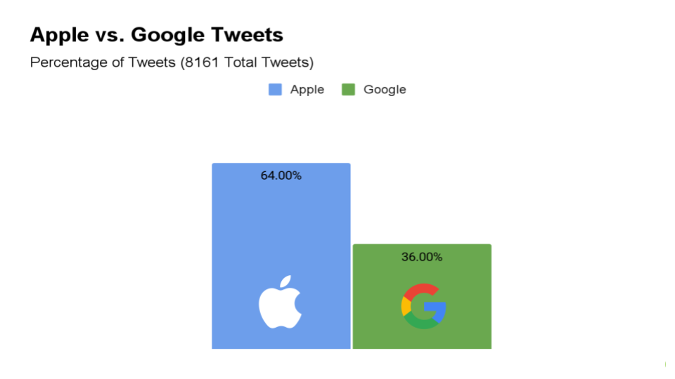
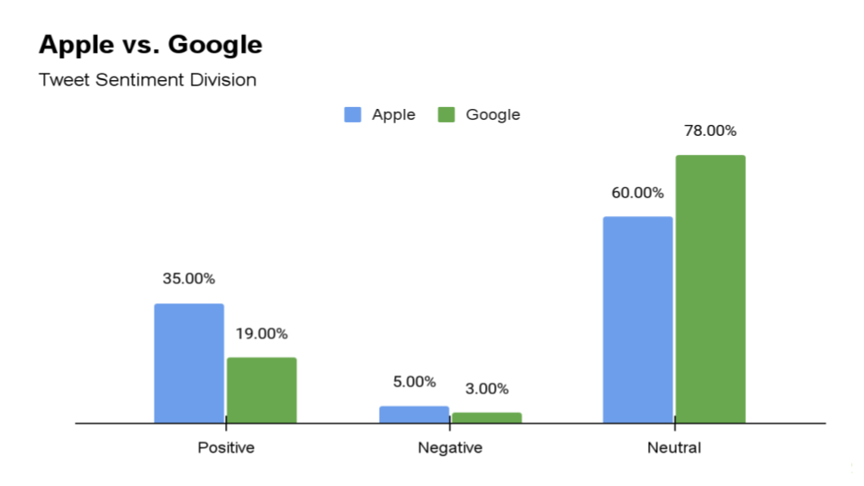
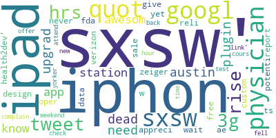

---
# Twitter Sentiment Analysis of Apple and Google for AT&T
---
  
# Phase 4 - Project 4 - Apple and Google Sentiment Analysis for AT&T
# Project Team:
- [**Jun (Andrew) Choi**](https://github.com/cjunhyuk)
- [**Peter Vuong**](https://github.com/petercvuong)
- [**Nicholas Wertz**](https://github.com/njw27)

---
## Table of Contents
---
#### 1. Business Understanding
#### 2. Introduction
#### 3. Data
#### 4. EDA and Preprocessing
#### 5. Modeling
#### 6. Evaluation
#### 7. Appendix
#### Repo Navigation

---
## 1. Business Understanding
---
In the ever expanding smartphone market, it is essential to keep up with customer demand. AT&T is deciding on which product brands to offer customers in their physical and online shops and have hired our data science team to help. We have been tasked with investigating the sentiment that customers express online towards different product lines to help make a decision on what products should be stocked immediately. We then will use this data to create a model that can predict customers' thoughts on a product so that the client can remain up to date with the product demands of their clientele.

---
## 2. Introduction
---
Our goal for this project is to utilize Natural Language Processing(**NLP**) to analyze and predict public sentiment for Apple and Google based on tweets gathered from the 2013 SXSW convention in Austin, Texas. 

--- 
## 3. Data
--- 
The dataset that we used for this project is from [**data.world**](https://data.world/crowdflower/brands-and-product-emotions)

#### Limitations
- Data is from only attendees of Austin's South by Southwest Festival
- From the year 2013
- We do not know the method of how they specifically gathered this data or the criteria the used to evaluate the sentiment

---
## 4. EDA and Preprocessing
---
The dataset that we used had 8161 total tweets from the SXSW conference. The tweet data was split between tweets about Apple and Google; however, there were almost twice as many tweets about Apple when compared to Google which is represented in this bar graph below.

. 

 

We next wanted to look at the sentiment split in the data which is represented in this bar graph below.

 

 

As you can see, Apple has more Positive and Negative tweets when compared to Google, and Google exhibits a more neutral sentiment. It is important to note that these percentages are based on the number of these product's respective tweets in the dataset. So 35% of the total tweets about Apple are positive (insert number here) and about 18% of the total tweets about Google are positive (which is about 550 tweets in total).

 

For the preprocessing step of this dataset, we cleaned up the dataset and changed the original columns from `emotion_in_tweet_is_directed_at` and `	is_there_an_emotion_directed_at_a_brand_or_product` to `product` and `emotion`, respectively. We converted the products and binned them into two categories (Apple and Google) to make the data easier to work with. We also converted the sentiment values to numeric values and binned them where: `Positive emotion: 0`, `Negative emotion: 1`, `No emotion toward brand or product: 2`, and `I can't tell: 3` to make it easier to interpret the results of our model. After this initial cleanup, we tokenized our data, made all the text lowercase, and removed any special and numerics characters. Once this preprocessing and cleaning was conducted we were able to run some machine learning models on our cleaned data.

---
## 5. Modeling
---

Our initial baseline model that we utilized was a Multinomial Bayes model. We selected a Multinomial Bayes model as our baseline because it has high versatility when it comes to NLP.
Our baseline model produced an accuracy score of 65% and a precision score of 59%. We chose to focus on precision in our project because precision focuses on false positives. False positives in the context of tweet sentiments would be predicting/identifying a tweet as having positive sentiment when in reality it actually possesses negative sentiment (e.g. sarcastic tweets).

 

The final model that we utilized was an ensemble model that was composed of a RandomForestClassifier and MultinomialNaiveBayes model with optimized hyperparameters from GridSearchCV. Our final accuracy score stayed about the same at 65%, but our precision score increased.

We decided to split the ensemble into two different sets to see how the model would perform for Apple and Google individually. 

  

Below is the graph confusion matrix and evaluation metrics for Apple

 

Below is the confusion matrix and evaluation metrics for Google.

 

---
## 6. Evaluation
---

Here we found that the sentiment breakdown for Apple was:
- Positive : 39.25%
- Negative : 4.27%
- Neutral : 56.48%  
With 63% Accuracy and 63% Precision  
 
While Google was: 
- Positive : 19.48%
- Negative : 2.19%
- Neutral : 78.33%  
With 68% Accuracy and 60% Precision  

This means that people have shown a more positive reaction to apple products in comparison to Google.  
While Google actually has a majority of neutral sentiment meaning that most people do not care either way.
From this we concluded that having both Apple and Google products would be beneficial to AT&T.  
However, placing more weight/emphasis on restocking Apple products may be more beneficial as there is more buzz on twitter in regards to Apple products which could increase profits as well as overall traffic to AT&T by virtue of simply having Apple products in stock.

---
## 7. Appendix
---

Word cloud that was produced for visualization can be seen here:

---
## Repo Navigation
---

├── [data/](https://github.com/cjunhyuk/Apple-Google-Sentiment-Analysis/tree/master/data)    -------------------------------------> Data used for this project collected by data.world.

├── [img/](https://github.com/cjunhyuk/Apple-Google-Sentiment-Analysis/tree/master/img) --------------------------------------> All images used in the notebook and README.md.

├── [.gitignore](https://github.com/cjunhyuk/Apple-Google-Sentiment-Analysis/blob/master/.gitignore) ---------------------------------> .gitignore used for the project.

├── [Final_Notebook - Jupyter Notebook.pdf](https://github.com/cjunhyuk/Apple-Google-Sentiment-Analysis/blob/master/Final_Notebook%20-%20Jupyter%20Notebook.pdf)            ---> A PDF of the final project notebook.

├── [Final_Notebook.ipynb](https://github.com/cjunhyuk/Apple-Google-Sentiment-Analysis/blob/master/Final_Notebook.ipynb)              ---------------------> The jupyter notebook containing the finalized code.

├── [Presentation.pdf](https://github.com/cjunhyuk/Apple-Google-Sentiment-Analysis/blob/master/Presentation.pdf)              --------------------------> A PDF of the Google Slides presentaion.

├── [README.md](https://github.com/cjunhyuk/Apple-Google-Sentiment-Analysis/blob/master/README.md)              ------------------------------> README.md for the project (you are here now).